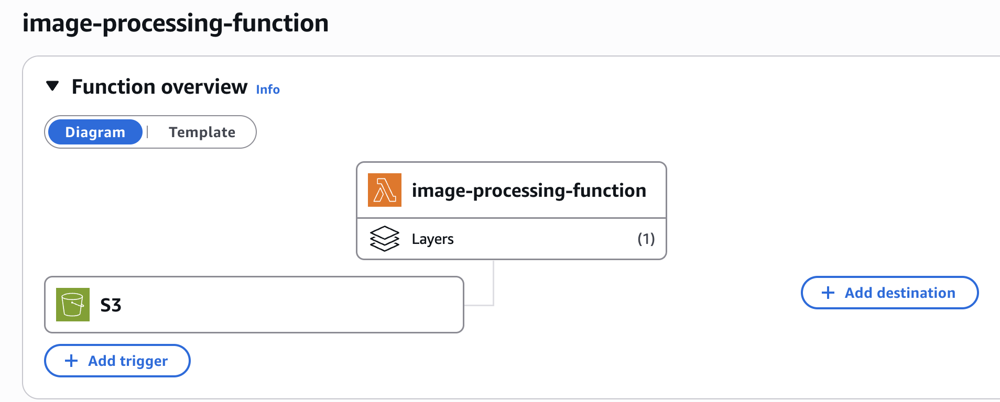
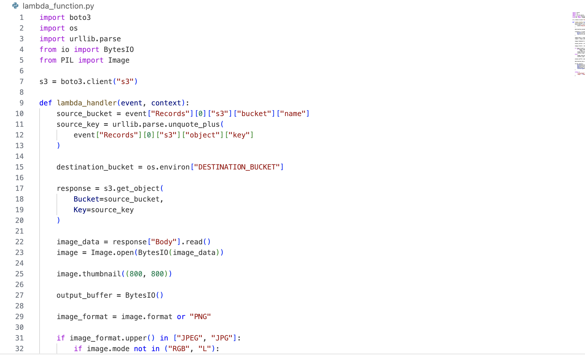
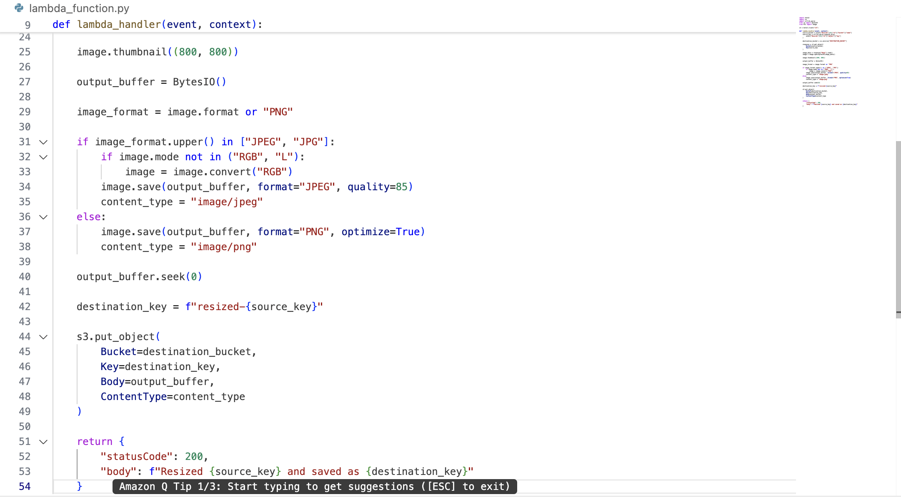
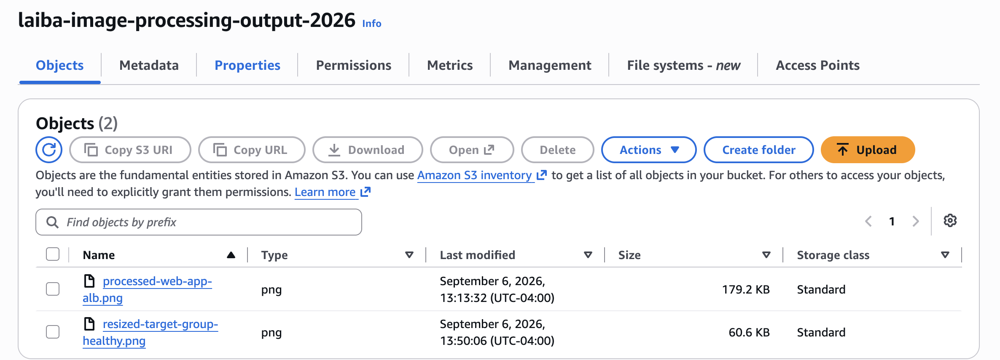
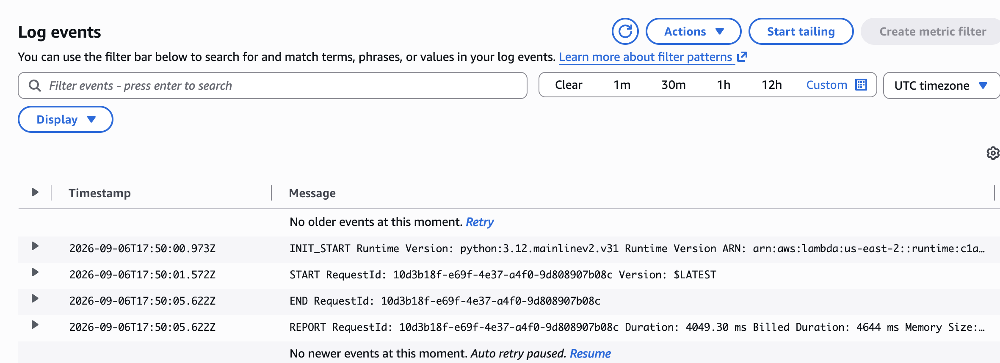

# Serverless Image Processing Pipeline on AWS

I built this project to see how an event-driven workflow could handle image processing without a continuously running server.

An image uploaded to Amazon S3 triggers a Lambda function automatically. The function processes the image, writes the resized version back to S3, and logs the execution in CloudWatch.

## Event-driven setup

The workflow starts with an S3 event. When a new image is uploaded, S3 invokes the Lambda function rather than relying on a server or a manually started process.

## How it works

1. An image is uploaded to the source location in S3.
2. The S3 event invokes the Lambda function.
3. Lambda reads the uploaded image and resizes it.
4. The processed image is written back to S3 as a new object.
5. I used CloudWatch logs to confirm that the function was being invoked and completing successfully.

## Lambda implementation

The Lambda function handles the processing step of the pipeline. It takes the object information from the S3 event, retrieves the uploaded image, resizes it, and saves the processed version back to S3 under a new key.

I used an environment variable for the destination bucket instead of hard-coding it into the function. Processed objects are written with a resized prefix so they can be distinguished from the original upload.

### Function code

## Testing the pipeline

To test the workflow, I uploaded an image to S3 and checked that the event triggered the Lambda function without manually invoking it.

After the function completed, I verified that the resized image had been written to the output S3 bucket.

I then checked the CloudWatch logs to verify the execution. The successful log entry confirmed that the function ran through the processing step without an execution error.

## Services used

- **Amazon S3** — stores the original and processed images and provides the event that starts the workflow.
- **AWS Lambda** — runs the image-processing code when an upload occurs.
- **Amazon CloudWatch** — provides the execution logs I used to verify and troubleshoot the function.
- **AWS IAM** — controls the permissions the Lambda function needs to work with S3 and write logs.

## What I learned

The biggest takeaway from this project was seeing how AWS services can react to events without a server sitting behind the workflow. I also got more comfortable working with Lambda permissions, S3 events, and using CloudWatch logs to check what was actually happening during an execution.

## What I would improve next

If I were taking this beyond a lab project, I would separate the original and processed images more clearly, add better error handling for unsupported or corrupted files, and tighten the IAM permissions around exactly what the function needs.

I would also add a dead-letter or failure path so unsuccessful processing attempts can be investigated instead of being silently missed.
